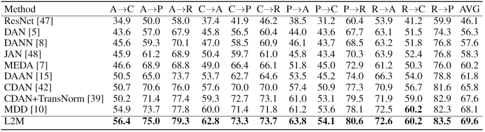
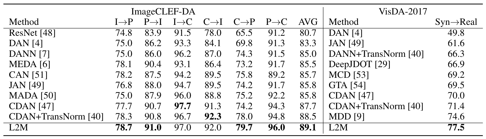
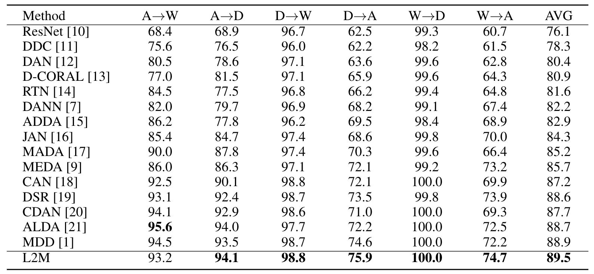
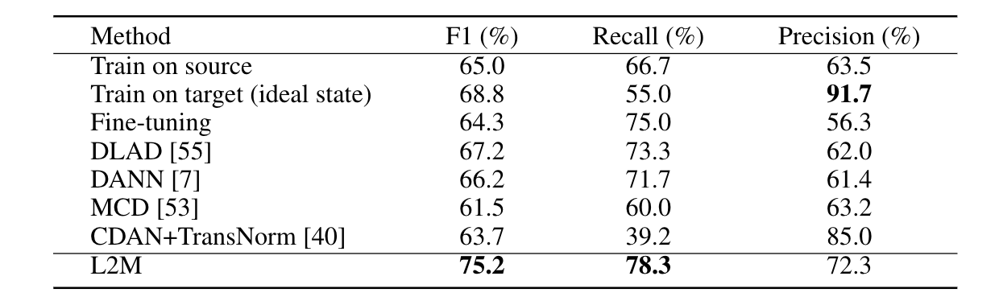

# Learning to Match Distributions for Domain Adaptation 

This repository is the official implementation of [Learning to Match Distributions for Domain Adaptation](https://arxiv.org/abs/2007.10791). 

## Requirements

We recommend that you use a conda virtual environment to run the following experiments .

Basic environment is pytorch > 1.0.

To install requirements:  
```setup
pip install -r requirements.txt
```

## Datasets
You need to download the datasets ([Office-Home](https://drive.google.com/file/d/0B81rNlvomiwed0V1YUxQdC1uOTg/view), [Office-31](https://mega.nz/file/dSpjyCwR#9ctB4q1RIE65a4NoJy0ox3gngh15cJqKq1XpOILJt9s), [ImageCLEF-DA](https://mega.nz/file/4LxzyKRJ#JJomZ-yC3ORAgM7oBpFsbWN0j4XVuWGNLfCO5_ly8_Q), [VisDA-2017](http://csr.bu.edu/ftp/visda17/clf/)) to ./data/. The data directory structure is as follows (e.g. Office-Home):
```dataset
./data/OfficeHome/
|__Art
|  |__Alarm_clock
|  |__Backpack
|  |__...
|
|__Clipart
|
|__Product
|
|__RealWorld
```

### Download dataset from GCR!

In a GCR machine at Microsoft, all you need to do is use the following command to download the datasets.

- Office31: `azcopy --source "https://transferlearningdrive.blob.core.windows.net/teamdrive/dataset/office31/" --destination "data/office31" --recursive`
- Office-Home: `azcopy --source "https://transferlearningdrive.blob.core.windows.net/teamdrive/dataset/OfficeHome/" --destination "data/OfficeHome" --recursive`
- ImageCLEF-DA: `azcopy --source "https://transferlearningdrive.blob.core.windows.net/teamdrive/dataset/image_CLEF/" --destination "data/image_CLEF" --recursive`
- VisDA: `azcopy --source "https://transferlearningdrive.blob.core.windows.net/teamdrive/dataset/visda/" --destination "data/visda" --recursive`

## Training

There are two alternatives for training:
- `train_new.py`, along with `model/L2M_trainer.py`: exactly follow the L2M paper.
- `train_critic.py`, along with `model/L2M_critic_trainer.py`: a critic way of training by following this [paper](https://arxiv.org/abs/1901.11448) and their [code](https://github.com/liyiying/Feature_Critic).

*The following are not useful anymore.*

- - -

## Training

To train the model(s) in the paper, run the following command. 

```train
CUDA_VISIBLE_DEVICES=0 python train.py --dataset Office-Home --root_path ./data/OfficeHome/ --source_dir Art --test_dir Clipart --save_path ./Art_Clipart.mdl --use_adv True --match_feat_type 3 >& A_C.log
```

Configurations:

- `--dataset` denotes the dataset
- `--source_dir` denotes the source domain
- `--test_dir` denote the target domain
- `--save_path` denotes the path to save the trained model
- `--use_adv` means using adversarial training
- `--match_feat_type` means the type of matching featues.

Other configurations can be found at `train.py`.


## Evaluation

To evaluate the model, run the following command. `--model_file` denotes the model trained on dataset Office-Home.

```eval
CUDA_VISIBLE_DEVICES=0 python eval.py --model_file Art_Clipart.mdl  --dataset Office-Home --root_path ./data/OfficeHome/ --source_dir Art --test_dir Clipart
```

## Pre-trained Models

For simplicity, we provide a pre-trained model for task `Art-Clipart` on Office-Home dataset here: [Art-Clipart pretrained model](https://www.dropbox.com/s/uggiamwwlrazcy6/Art_Clipart.mdl?dl=0). This model can be used directly for evaluation.


## Results

The results of L2M are as follows.

* The classification accuracy (%) on the Office-Home dataset for UDA (ResNet-50):  


* The classification accuracy (%) on the ImageCLEF-DA and VisDA-17 datasets for UDA (ResNet-50):  


* The classification accuracy (%) on the Office-31 dataset for UDA (ResNet-50):  


* The classification accuracy (%) on the COVID-19 chest X-ray image adaptation (Pneumonia &rarr; COVID-19, ResNet-18):  


